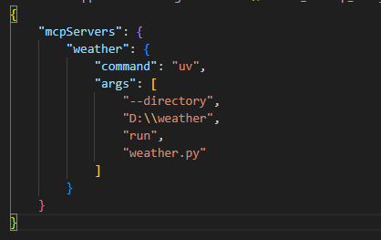

# Weather MCP Server

A Python-based MCP sdk, weather information tool that provides weather alerts and forecasts using the National Weather Service (NWS) API.

## Installation

1. Ensure you have Python 3.12+ installed
2. Install dependencies using `uv`:
```sh
uv pip install .
```
3. After installation, download Claude Desktop app
4. Create or edit configuration file at (C:\Users\username\AppData\Roaming\Claude\claude_desktop_config.json) with below similar configuration



5. Open your Claude Desktop app, in the text field area a small hammer-like icon should appear on right hand side.
6. Now you can enter query, if related to weather it will use respective MCP tools.

## Usage

This application is designed to work as an MCP (Model Context Protocol) server. It provides two main tools:

### Get Weather Alerts

Retrieves active weather alerts for a specified US state:

### Get Weather Forecast

Retrieves weather forecast for a specific location using coordinates:

